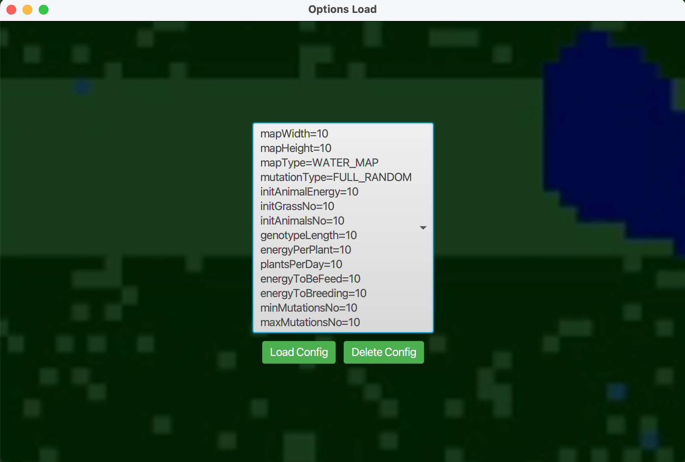
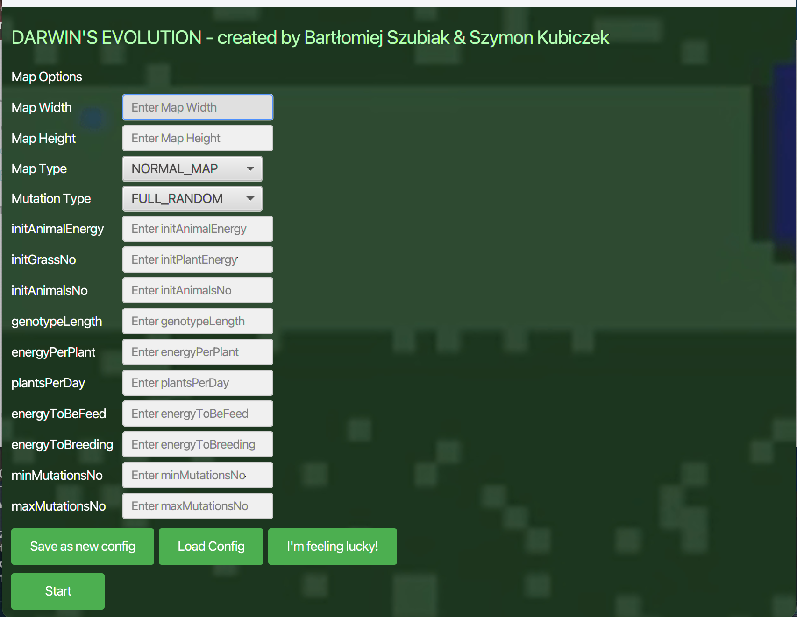

### 📝 Description:

This project is a simulation of an environment inspired by Darwin's theory, where animals fight for survival in a dynamically changing environment. The implementation is written in Java.

### 📄 Project Assignment:

The project assignment can be found [here](https://github.com/Soamid/obiektowe-lab/tree/master/proj).

### 👨‍💻 Authors:

The project was developed by the following individuals:

1. **Szymon Kubiczek**
2. **Bartłomiej Szubiak**

### 🛠️ Additional Features:

Our project group focused on the following elements:

1. Water Map
2. Minor Gene Improvement

### 🖼️ Images:

Several sample images from the application's functionality





### 🔧 Installation Instructions:

1. Clone the repository to your computer:
   ```
   git clone repository_link
   ```
2. Open the project in a development environment (e.g., IntelliJ IDEA, Eclipse).
3. Run the application.

### 🧪 Features:

- Random generation of the environment with various starting options.
- Simulation of animal behaviors.
- Population statistics and dynamics.
- Visualization of the simulation using a simple graphical user interface.
- Configurable environment parameters and animal behaviors.
- Ability to save and load settings.
- Ability to save simulation statistics to a **csv** file.
