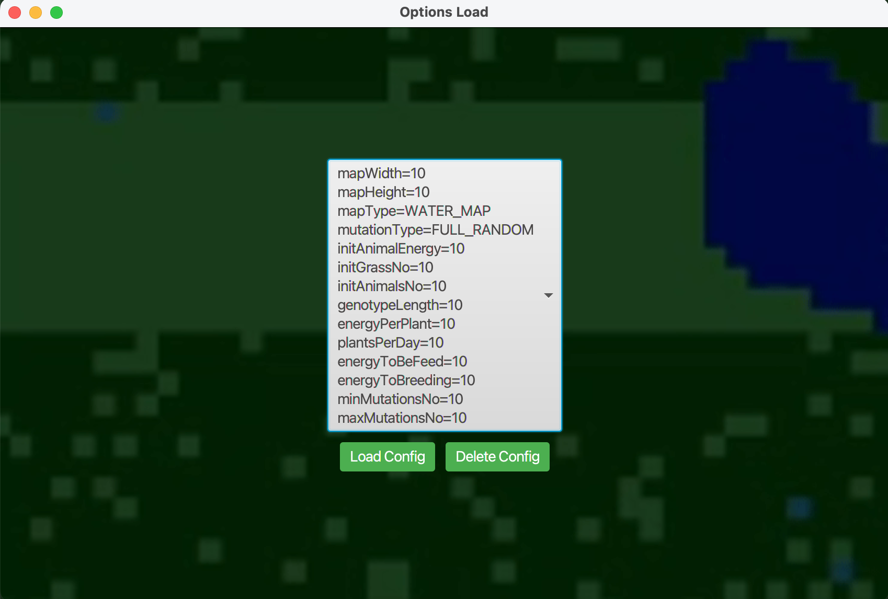
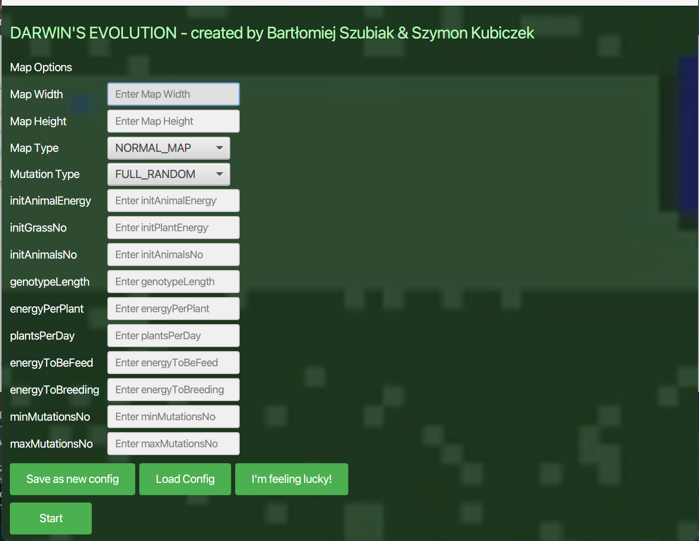
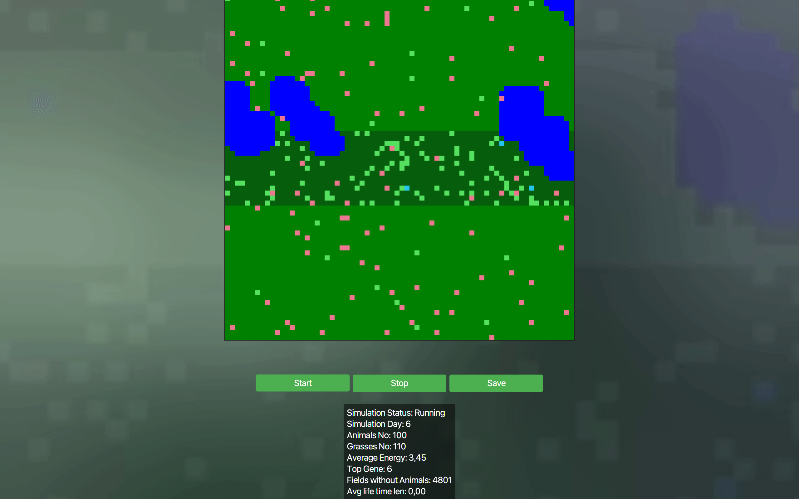
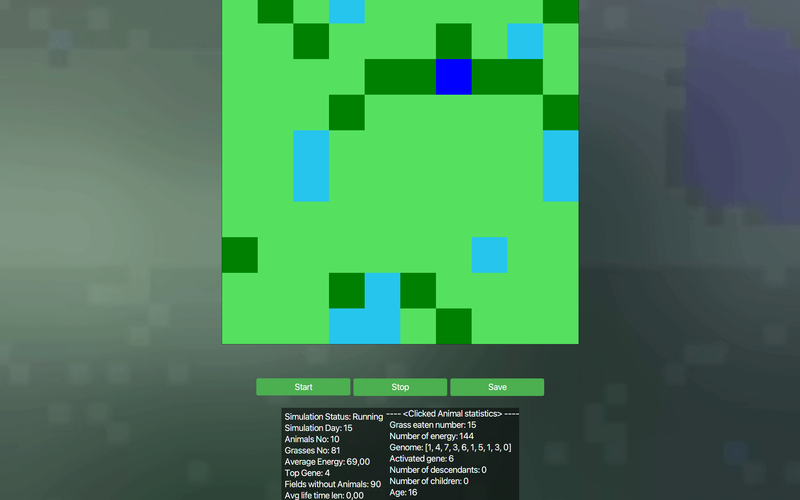

### 📝 Opis:

Projekt ten jest symulacją środowiska inspirowanego przez teorię Darwina, gdzie zwierzęta walczą o przetrwanie w dynamicznie zmieniającym się środowisku. Implementacja jest napisana w języku Java.

### 📄 Polecenie projektu:

Polecenie do projektu znajduje się [tutaj](https://github.com/Soamid/obiektowe-lab/tree/master/proj).

### 👨‍💻 Autorzy:

Projekt został opracowany przez następujące osoby:

1. **Kubiczek Szymon**
2. **Bartłomiej Szubiak**

### 🛠️ Dodatkowe elementy:

Nasza grupa projektowa skupiła się na następujących elementach:

1. Wodna Mapa
2. Drobna Poprawka dla genów

### 🖼️ Zdjęcia:

Kilka przykładowych zdjęć z działania aplikacji






### 🔧 Instrukcja instalacji:

1. Sklonuj repozytorium na swój komputer:
   ```
   git clone link_do_repozytorium
   ```
2. Otwórz projekt w środowisku programistycznym (np. IntelliJ IDEA, Eclipse).
3. Uruchom aplikację.

### 🧪 Funkcje:

- Losowe generowanie środowiska z różnymi opcjami startowymi.
- Symulacja zachowań zwierząt.
- Statystyki dotyczące populacji i dynamiki zmian.
- Wizualizacja symulacji za pomocą prostego graficznego interfejsu użytkownika.
- Konfigurowalne parametry środowiska i zachowań zwierząt.
- Możliwość zapisania i wczytania ustawień
- Możliwośc zapisania statystyk symulacji do pliku **csv**

### Grupa Projektowa:

gr pt 9:40 Zbigniew Kaleta
